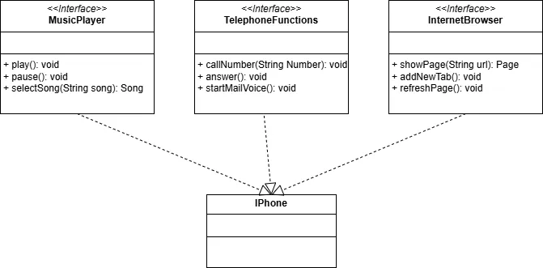

# POO - Desafio - UML do iPhone
---
Desafio de modelar e diagramar a representação UML do componente iPhone, abrangendo suas funcionalidades como Reprodutor Musical, Aparelho Telefônico e Navegador na Internet.
---

